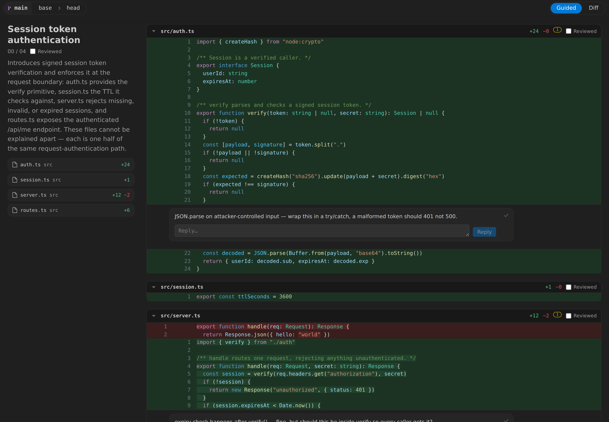
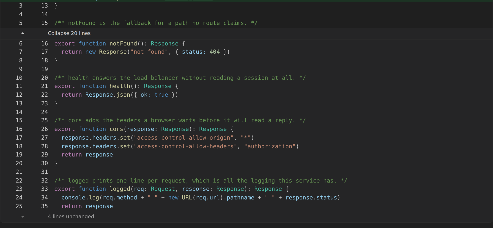
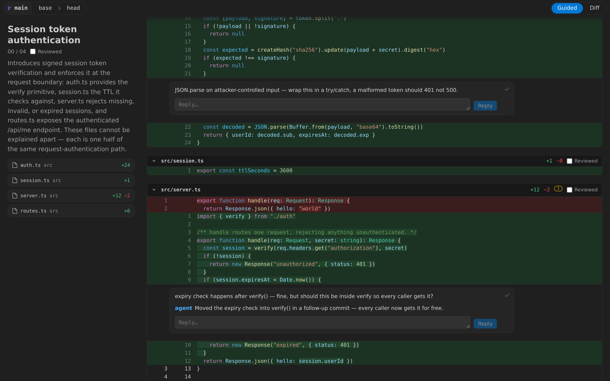
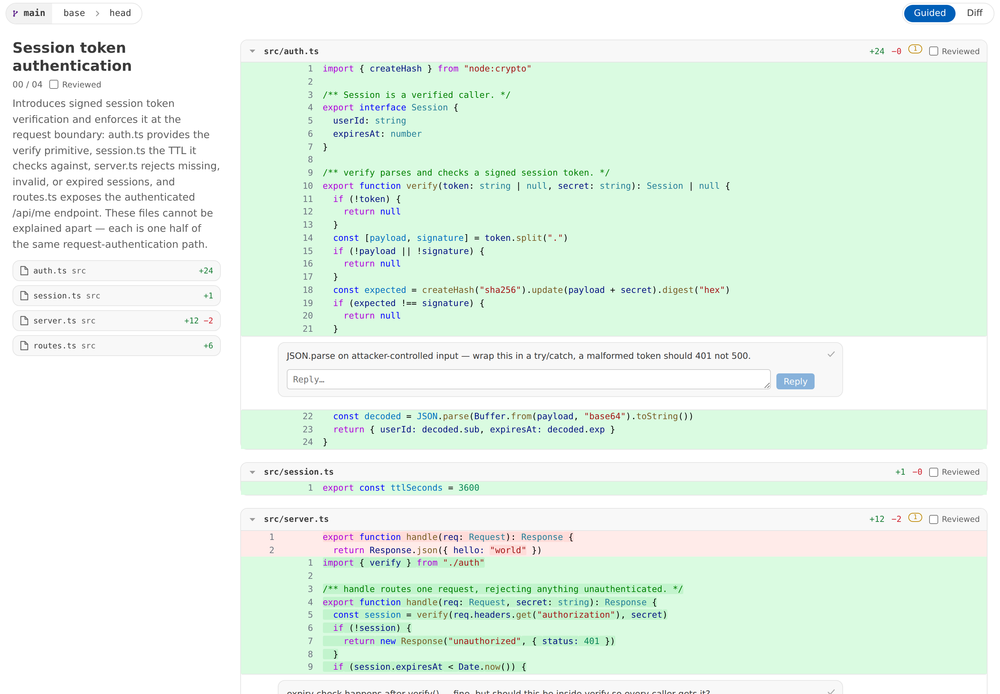

# Guided Reviews

A VS Code extension for reviewing your own commits locally — with an AI-guided
narrative of the change, and comment threads a coding agent can read and reply to.

Everything is local. Review state never enters git and never reaches a server.



## How to start a review

You can start a guided review in three ways:

1. **Press ⌥⇧R** (`alt+shift+r` on Linux and Windows), anywhere but a focused terminal.

2. **Open the command palette** with ⇧⌘P and run **Guided Reviews: Open Review**.

3. **Ask your agent.** Say "let me review this branch" or "let me review this commit".

## How to read the diff

**Open the lines the diff left out.** Every run of unchanged code carries a bar counting what
it hides. Click anywhere on it and the whole run opens, so the number you collapse is the
number you were offered. `Show 20` takes a step instead, for a run too long to want in one go.

**Shut it again.** The bar becomes the run's handle and holds the top of the pane while the
lines it opened are on screen, so the way back is one click away however far in you have
scrolled. Whatever is still hidden keeps its own mark, at the edge those lines actually sit
behind. A run holding a comment thread stays open far enough to show it.



## How to send feedback to agents

**Leave comments on the lines they belong to.** Click a line number, write the comment.
Every thread lands against that exact line and follows it as you commit.

**Ask your agent to "check the review and make the changes".** It reads your unresolved
threads through the CLI the extension installs, fixes the code, and commits.

**Read its replies in the panel.** The agent answers each thread as it finishes, saying
what it did and where; the replies appear live, without a reload.



**Resolve once you are satisfied.** Tick a thread's corner and it collapses to one line
you can expand again. An agent can never resolve — only reply — and resolved threads are
never shown to it again. Comment on a resolved thread to reopen it.

# Development

## Install

```sh
npm install
npm run build
npx @vscode/vsce package
code --install-extension guided-reviews-0.1.0.vsix
```

The guided review shells out to the `claude` CLI. Point `guidedReviews.claudePath` at it
if it is not on your `PATH`. Everything else works without it — a failed or missing
guide leaves a Retry button in the toolbar, with the diff fully usable. A guide that
classifies nothing is treated as a failure rather than shown as an empty result.

## How it is put together

```
src/core        pure domain logic — no vscode, no react   (git, event log, relocation, guide)
src/cli         the agent-facing review command
src/extension   activation, commands, panel host, file watching
src/webview     the review UI
```

`src/core` is where the real logic lives and where the tests are. The other three are
thin adapters. The boundary is enforced by an eslint import rule.

**The store is an append-only JSONL event log**, one file per review, folded by a single
function that both the panel and the CLI use — so they cannot disagree. Appends below
4 KB are atomic under POSIX `O_APPEND`, so two writers never corrupt each other; a lock
is taken only for larger records.

**The diff renders through `react-diff-view`** in unified mode, with comment threads
anchored via its `widgets` API. Each hunk renders as its own table, and an opened run as one
more between them, holding lines the host reads out of the base blob — a run is a number of
lines rather than an edit to the patch, so collapsing puts the file back exactly as it was. Syntax
highlighting is Shiki running the same TextMate grammars VS Code itself uses, bridged into
the library's refractor-shaped hook. Every colour and font comes from `--vscode-*` theme
variables, so the panel looks native in any theme.



**Grammars load per review, not up front.** All 242 of Shiki's languages ship, split one
chunk per grammar; the review's changed paths decide which to import, so opening a
TypeScript review never parses the C++ grammar. Bundling them eagerly instead cost a
measured +419 ms on every panel open. This way the entry bundle is 485 KB (154 KB gzip),
first highlighted row lands in ~700 ms regardless of language count, and the only price
is vsix size — 2 MB rather than 745 KB.

`src/webview/grammars.ts` is generated from Shiki's own language metadata by
`npm run gen:grammars`; re-run it after upgrading Shiki. `extensionOverrides` in
`highlight.ts` holds only the extensions Shiki's aliases miss (`.h`, `.hpp`, `.tf`,
`.gradle`, and friends).

## Tests

```sh
npm test          # 202 unit and integration tests
npm run typecheck
npm run lint
```

The git layer is tested against real temporary repositories running the real `git`
binary — merge-base, rename detection and diff parsing are what is under test, and
mocking them would only test assumptions about git.

```sh
npx vitest run -c vitest.e2e.config.ts   # full stack against the real claude binary
```

## Releasing

Two workflows in `.github/workflows`:

- **CI** runs on every pull request and on `main`: lint, typecheck, the full test
  suite, a build, and a real `vsce package`. The packaged vsix is uploaded as a build
  artifact, so a reviewer can install the exact bits a PR produces.
- **Release** runs on any `v*` tag. It re-runs every check, packages the extension, and
  publishes a GitHub release with the vsix attached. It refuses to publish when the tag
  and `package.json` version disagree, and a tag carrying a suffix (`v0.2.0-beta.1`)
  publishes as a pre-release.

```sh
npm version minor        # bump package.json and tag
git push --follow-tags
```

Neither workflow runs the `claude` end-to-end suite — it needs credentials and costs
money per run. Run that locally before tagging.

## Known limits

- No split view. Unified only.
- Uncommitted work is out of scope by design; this reviews commits.
- The branch dropdown lists local branches only, and each commit dropdown reaches 50
  commits back — an older commit cannot be selected as a base.
- Large diffs are not virtualised yet. `react-diff-view` mounts every row, so a
  several-thousand-line diff will feel heavy; per-file lazy mounting is the planned fix.
- Binary files render as a stub and cannot be commented on.
- Syntax highlighting covers every language Shiki ships (242), including the config
  formats a diff is full of. A file whose extension is not mapped renders as plain text
  even when a grammar exists — add it to `extensionOverrides`.
- Themes other than Default Dark+/Light+ get correct UI colours but Dark+/Light+ token
  colours — VS Code exposes no API for a theme's syntax colours.
</content>
</invoke>
