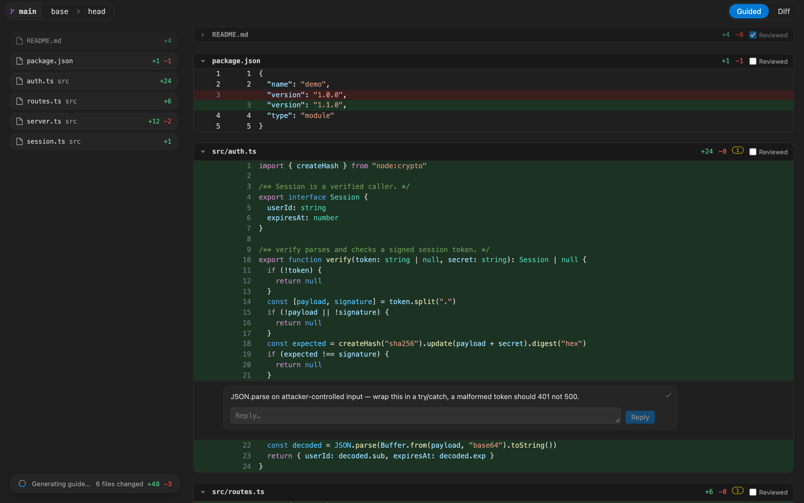

# Guided Reviews

A VS Code extension for reviewing your own commits locally — with an AI-guided
narrative of the change, and comment threads a coding agent can read and reply to.

Everything is local. Review state never enters git and never reaches a server.


## What it does

**Review your branch.** The panel opens on the branch you are standing on: its head
against the commit it forked from. The base is pinned when the review is created, so it
does not drift when the default branch moves; commit again and the review follows your
head.

**Read the change as a narrative.** The guided view groups the diff into ordered
chapters — the core of the change first, then its consequences, then glue and
supporting edits — each with a title and a one-or-two sentence summary, generated by
Claude Code running headless on your machine. Each chapter's summary stays pinned
beside its files and releases at the next chapter, so you always know which part of the
change you are reading.


**Comment on lines.** Click a line number, write a comment. Every thread has a reply box
and a tick in its corner; ticking it resolves the thread, which collapses it to one line
you can expand again. Commenting on a resolved thread reopens it. You resolve; nothing
else can.

**Tick files off as you go.** Each file has a *Reviewed* checkbox that collapses it, and
each chapter has one that ticks off every file it covers at once, beside its own count.
The tick is recorded against that file's blob, so it clears itself the moment the file
changes underneath you.

**The left column is the map.** Before a guide exists it is one stacked list of every
changed file; clicking a card scrolls the diff pane to it. Once the guide lands the list
breaks into its chapters, each under its own title and summary. Generation starts on its
own when a review has no guide yet, and a pill floats over the bottom of the column with
the review's total diffstat while it runs. Narrow the panel and the two columns collapse:
each chapter's guide sits directly above the diffs it describes, and the file list goes
away.



**Hand them to an agent.** Tell Claude "address the guided review comments". It reads
your threads, fixes the code, commits, and replies — and the replies appear in the
panel live.

**Comments survive your commits.** When you commit again, threads re-pin themselves to
the line they now belong on, by exact hunk-offset arithmetic. A thread only goes
`outdated` when its line is genuinely gone, and even then it stays visible with the
code it was written against.

## Open a review

Three ways in. An agent, or you, from a terminal:

```sh
.guided-review/bin/review open
```

The keybinding **⌥⇧R** (`alt+shift+r` on Linux and Windows), anywhere but a focused
terminal.

The command palette entry **Guided Reviews: Open Review**.

All three do the same thing: they open the UI immediately. You are never asked to pick
revisions first.

- **On a feature branch** you land straight in the diff. Target is that branch's head,
  base is the commit it forked from.
- **On the default branch** there is no fork, so both selectors run over main's own
  history: base is the previous commit, target is the head. The newest commit, in other
  words.

The panel is scoped to one branch, named in its own line above the diff:

```
⑂ Review feat/x ▾
[ main ▾  →  head ▾ ]
```

That line is the branch dropdown — it picks the branch under review and with it the whole
timeline. Both commit dropdowns select out of that one ancestry, so a pair spanning two
unrelated branches cannot be expressed. Choosing a branch snaps the base back to the
commit it forked from.

The commits name themselves by what they are rather than by sha wherever they can. The
tip reads `head`, the fork point reads `main` — so the resting state is `main → head`,
with no shas at all. A sha appears once you move off those: go back past the fork and the
base reads `main / c0e64a2`; move it up onto the branch's own commits and it is a bare
sha, since the line above already names the branch. The full sha is on hover throughout.

Inside a dropdown, commits at or after the fork point are blue and the ones before it —
shared with the branch you forked from — are orange, with a marker ruling off where the
branch diverged. On the default branch there is no fork, so there is no marker and no
colour split; the rows are plain.

Changing any selector re-points the same panel rather than opening a second tab, and
each commit pair keeps its own comment log, so going back to a pair restores its
threads. Nothing bleeds across pairs. **Guided Reviews: Delete Review** removes one
pair's log.

## Working with an agent

On activation — and from **Guided Reviews: Install Agent Skill and CLI** — the extension
writes two things into your workspace:

- `.guided-review/bin/review` — the CLI, run through VS Code's own Node so it works with
  no `node` on `PATH`.
- `.agents/skills/guided-reviews/SKILL.md` — the skill that teaches an agent the commands
  below. That is the Agent Skills standard directory, which Cursor and Codex read
  natively; `.claude/skills/guided-reviews` is symlinked to it because Claude Code reads
  only `.claude/skills`. Where the OS refuses symlinks, a second copy is written there
  instead.

Both are hidden from git: the store ignores itself, and both skill paths are added to
`.git/info/exclude`, which is per-clone and never committed. Your `.gitignore` is not
touched.

```sh
.guided-review/bin/review open                   # open the panel on this branch
.guided-review/bin/review comments               # unresolved threads, as markdown
.guided-review/bin/review comments --unanswered  # only ones the agent has not answered
.guided-review/bin/review comments --json        # the same, structured
.guided-review/bin/review reply <thread-id> -m "handled the null case in abc123"
```

There is deliberately **no resolve command**. An agent can reply; only the human
reviewer decides whether their own comment was addressed. Resolved threads are never
shown to the agent again.

## Install

```sh
npm install
npm run build
npx @vscode/vsce package
code --install-extension guided-reviews-0.1.0.vsix
```

The guided review shells out to the `claude` CLI. Point `guidedReviews.claudePath` at it
if it is not on your `PATH`. Everything else works without it — a failed or missing
guide leaves a Retry button in the toolbar, with the diff fully usable. A guide that
classifies nothing is treated as a failure rather than shown as an empty result.

## How it is put together

```
src/core        pure domain logic — no vscode, no react   (git, event log, relocation, guide)
src/cli         the agent-facing review command
src/extension   activation, commands, panel host, file watching
src/webview     the review UI
```

`src/core` is where the real logic lives and where the tests are. The other three are
thin adapters. The boundary is enforced by an eslint import rule.

**The store is an append-only JSONL event log**, one file per review, folded by a single
function that both the panel and the CLI use — so they cannot disagree. Appends below
4 KB are atomic under POSIX `O_APPEND`, so two writers never corrupt each other; a lock
is taken only for larger records.

**The diff renders through `react-diff-view`** in unified mode, with comment threads
anchored via its `widgets` API. Syntax highlighting is Shiki running the same TextMate
grammars VS Code itself uses, bridged into the library's refractor-shaped hook. Every
colour and font comes from `--vscode-*` theme variables, so the panel looks native in
any theme.


**Grammars load per review, not up front.** All 242 of Shiki's languages ship, split one
chunk per grammar; the review's changed paths decide which to import, so opening a
TypeScript review never parses the C++ grammar. Bundling them eagerly instead cost a
measured +419 ms on every panel open. This way the entry bundle is 485 KB (154 KB gzip),
first highlighted row lands in ~700 ms regardless of language count, and the only price
is vsix size — 2 MB rather than 745 KB.

`src/webview/grammars.ts` is generated from Shiki's own language metadata by
`npm run gen:grammars`; re-run it after upgrading Shiki. `extensionOverrides` in
`highlight.ts` holds only the extensions Shiki's aliases miss (`.h`, `.hpp`, `.tf`,
`.gradle`, and friends).

## Tests

```sh
npm test          # 202 unit and integration tests
npm run typecheck
npm run lint
```

The git layer is tested against real temporary repositories running the real `git`
binary — merge-base, rename detection and diff parsing are what is under test, and
mocking them would only test assumptions about git.

```sh
npx vitest run -c vitest.e2e.config.ts   # full stack against the real claude binary
```

## Releasing

Two workflows in `.github/workflows`:

- **CI** runs on every pull request and on `main`: lint, typecheck, the full test
  suite, a build, and a real `vsce package`. The packaged vsix is uploaded as a build
  artifact, so a reviewer can install the exact bits a PR produces.
- **Release** runs on any `v*` tag. It re-runs every check, packages the extension, and
  publishes a GitHub release with the vsix attached. It refuses to publish when the tag
  and `package.json` version disagree, and a tag carrying a suffix (`v0.2.0-beta.1`)
  publishes as a pre-release.

```sh
npm version minor        # bump package.json and tag
git push --follow-tags
```

Neither workflow runs the `claude` end-to-end suite — it needs credentials and costs
money per run. Run that locally before tagging.

## Known limits

- No split view. Unified only.
- Uncommitted work is out of scope by design; this reviews commits.
- The branch dropdown lists local branches only, and each commit dropdown reaches 50
  commits back — an older commit cannot be selected as a base.
- Large diffs are not virtualised yet. `react-diff-view` mounts every row, so a
  several-thousand-line diff will feel heavy; per-file lazy mounting is the planned fix.
- Binary files render as a stub and cannot be commented on.
- Syntax highlighting covers every language Shiki ships (242), including the config
  formats a diff is full of. A file whose extension is not mapped renders as plain text
  even when a grammar exists — add it to `extensionOverrides`.
- Themes other than Default Dark+/Light+ get correct UI colours but Dark+/Light+ token
  colours — VS Code exposes no API for a theme's syntax colours.
</content>
</invoke>
